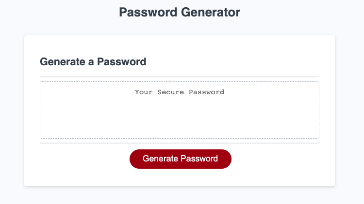

# Password Generator

An application that generates a random password based on the criterias entered.
[Deployment](https://anusontarangkul.github.io/password-generator/)

## Description

A powerful password is needed to protect yourself from cybersecurity attacks. This application generates a password at random that would signficantly protect yourself from hackers and other cybersecurity attacks.

The application prompts the user on what password criterias that the user needs in order to create the appropriate password. The criterias are as followed:

- How long the password should be.
- What character types should be included.

## Installation

No installation needed.

## Usage

1. Click "Generate Password".
2. Answer how many characters you want the password to be.
3. Answer if you want to include lowercase characters.
4. Answer if you want to include uppercase characters.
5. Answer if you want to include numbers.
6. Answer if you want to include special characters.
7. A password will be generated for you to use.

## Credits

David Anusontarangkul
[LinkedIn](https://www.linkedin.com/in/anusontarangkul/)
[Github](https://github.com/anusontarangkul)

## License

MIT License

Copyright (c) [2020] [David Anusontarangkul]

Permission is hereby granted, free of charge, to any person obtaining a copy
of this software and associated documentation files (the "Software"), to deal
in the Software without restriction, including without limitation the rights
to use, copy, modify, merge, publish, distribute, sublicense, and/or sell
copies of the Software, and to permit persons to whom the Software is
furnished to do so, subject to the following conditions:

The above copyright notice and this permission notice shall be included in all
copies or substantial portions of the Software.

THE SOFTWARE IS PROVIDED "AS IS", WITHOUT WARRANTY OF ANY KIND, EXPRESS OR
IMPLIED, INCLUDING BUT NOT LIMITED TO THE WARRANTIES OF MERCHANTABILITY,
FITNESS FOR A PARTICULAR PURPOSE AND NONINFRINGEMENT. IN NO EVENT SHALL THE
AUTHORS OR COPYRIGHT HOLDERS BE LIABLE FOR ANY CLAIM, DAMAGES OR OTHER
LIABILITY, WHETHER IN AN ACTION OF CONTRACT, TORT OR OTHERWISE, ARISING FROM,
OUT OF OR IN CONNECTION WITH THE SOFTWARE OR THE USE OR OTHER DEALINGS IN THE
SOFTWARE.
